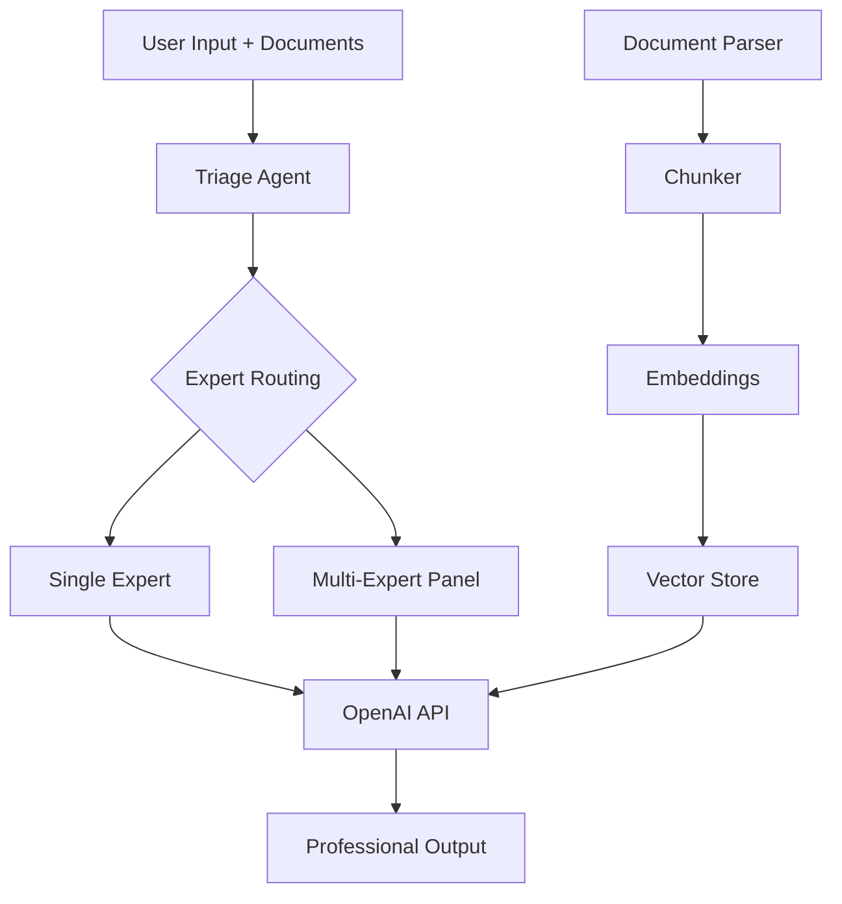

# openai-cli

**AI-powered document analysis with 65+ expert consultation roles.**

Predefined specialist roles — from attorneys and doctors to tax advisors and architects. Reads documents of any format, automatically activates the right expert, and produces professional outputs like lawsuits, tax returns, or expert opinions.

**Free and open source.** Just connect with your OpenAI account.

---

## Features

- **65+ Expert Roles** — Legal, Tax & Finance, Medical, Real Estate, Insurance, Business, Academia, Engineering, Consumer
- **Automatic Expert Routing** — Detects which specialist is needed based on your documents and questions
- **All Document Formats** — PDF, DOCX, XLSX, CSV, PowerPoint, Pages, Numbers, Keynote, HTML, Emails, Images (OCR), Archives
- **Professional Outputs** — Lawsuits, objections, tax returns, expert opinions, official letters
- **Multi-Expert Panel** — Multiple experts simultaneously for complex cases (e.g., divorce: family law + tax + real estate)
- **Configurable** — Global and project-specific OPENAI.md configuration files
- **Pipe-friendly** — Non-interactive mode for scripting
- **RAG Pipeline** — Semantic search across document collections via embeddings

## Installation

### Homebrew (recommended, macOS)

```bash
brew tap marcelrgberger/tap
brew install openai-cli
```

### npm

```bash
npm install -g openai-cli
```

### From Source

```bash
git clone https://github.com/marcelrgberger/openai-cli.git
cd openai-cli
npm install
npm run build
npm link
```

## Setup

You need an OpenAI API key. Get one at [platform.openai.com](https://platform.openai.com/api-keys).

```bash
# Option 1: Environment variable
export OPENAI_API_KEY="sk-..."

# Option 2: Pass at startup
openai-cli --api-key "sk-..."

# Option 3: Save to settings
# Automatically saved after first --api-key call
```

## Usage

### Interactive Mode

```bash
openai-cli
```

```
  openai-cli — Expert Document Agent
  65+ Expert Roles | Document Analysis | Professional Outputs

openai-cli > Check my employment contract for problematic clauses
[Employment Law Attorney activated]
...

openai-cli > Draft a termination protection lawsuit
[Generating professional document]
...
```

### Non-Interactive Mode

```bash
# Analyze a single document
openai-cli --print "Summarize this document" < contract.pdf

# Analyze a directory
openai-cli --dir ./tax-receipts/ --print "Prepare a tax return from these receipts"

# Use a specific role
openai-cli --role steuerberater --print "Check this tax assessment"
```

### Commands

| Command | Function |
|---|---|
| `/help` | Show help |
| `/roles` | List all 65+ expert roles |
| `/role <id>` | Activate a specific role (e.g., `/role steuerberater`) |
| `/role` | Enable automatic routing |
| `/model <name>` | Switch model (gpt-4o, gpt-4o-mini, o3, o4-mini) |
| `/clear` | Clear conversation |
| `/exit` | Exit |

## Expert Roles

### Legal (15 Roles)
Employment Law, Family Law, Tenant Law, Traffic Law, Inheritance Law, Criminal Law, Medical Law, Social Law, Administrative Law, IT Law, Corporate Law, Insolvency Law, Construction Law, Insurance Law, Tax Law

### Tax & Finance (8 Roles)
Tax Advisor, Financial Advisor, Auditor, Accountant, Payroll Specialist, Controller, Grants Advisor, Customs Advisor

### Medical & Health (10 Roles)
General Medicine, Cardiology, Orthopedics, Neurology, Dermatology, Dentistry, Psychology, Pharmacy, Nutrition, Medical Coding

### Real Estate & Construction (6 Roles)
Architect, Property Valuator, Real Estate Agent, Structural Engineer, Energy Consultant, Property Manager

### Insurance & Retirement (4 Roles)
Insurance Advisor, Pension Advisor, Disability Insurance Advisor, Health Insurance Advisor

### Business & Startups (6 Roles)
Management Consultant, Startup Advisor, HR Advisor, Data Protection Officer, Compliance Officer, Patent Advisor

### Academia & Science (4 Roles)
Scientific Editor, Statistician, Specialist Translator, Educator

### Engineering (4 Roles)
Vehicle Expert, Electrical Engineer, Environmental Expert, IT Expert

### Consumer (5 Roles)
Consumer Protection, Debt Counselor, Travel Rights, Government Services Guide, Mediator

## Supported Document Formats

| Category | Formats |
|---|---|
| Text | .txt, .md, .rst, .tex, .rtf |
| Office | .pdf, .docx, .doc, .xlsx, .xls, .csv, .tsv, .pptx, .ppt |
| Apple | .pages, .numbers, .key |
| Web | .html, .htm, .xml, .json, .yaml, .yml |
| Email | .eml, .msg |
| Images (OCR) | .png, .jpg, .jpeg, .tiff, .bmp, .gif, .webp |
| E-Books | .epub |
| Archives | .zip, .tar.gz, .tar |

## Configuration

### Global: `~/.openai-cli/OPENAI.md`

```markdown
# OPENAI.md

## Model
- Default: gpt-4o
- For complex reasoning: o3

## Language
- German

## Preferences
- Always cite legal references
- Highlight deadlines
```

### Project: `./OPENAI.md`

```markdown
# OPENAI.md

## Context
Documents for my 2025 tax return.

## Instructions
- Focus: Income tax, work-related expenses
- Employee, tax class 1
```

## Custom Expert Roles

Place custom roles as `.md` files in `~/.openai-cli/roles/`:

```markdown
---
id: my-expert
name: My Custom Expert
category: custom
triggers:
  - keyword1
  - keyword2
outputs:
  - output1
---

# My Custom Expert

## Expertise
Description...
```

## Architecture



## Platform

**openai-cli is currently optimized for macOS.** Apple document formats (.pages, .numbers, .key) use macOS-native tools (`textutil`).

**Contributions for Windows and Linux are very welcome!** If you'd like to port openai-cli to other platforms, we appreciate pull requests.

## Documentation

- [User Guide](docs/USER_GUIDE.md) — Detailed usage instructions with examples
- [Developer Guide](docs/DEVELOPER_GUIDE.md) — Architecture, contributing, adding roles/parsers/tools

## Disclaimer

> This software provides AI-assisted analysis and drafts. It does **not** replace professional consultation by licensed lawyers, doctors, tax advisors, or other specialists. All information is provided without warranty. For legally binding actions, always consult a licensed professional.

## License

MIT License — Marcel R. G. Berger

## Contributing

Contributions are welcome! Especially needed:
- New expert roles (especially for non-German jurisdictions)
- Windows/Linux compatibility
- Additional document formats
- Improvements to existing roles
- Tests
